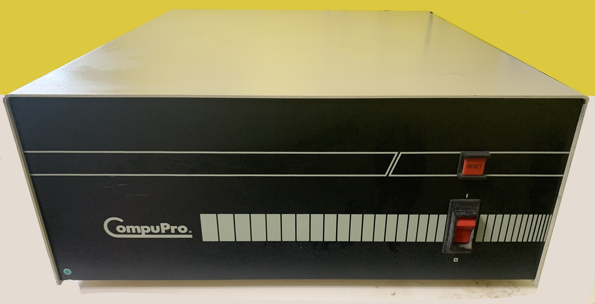
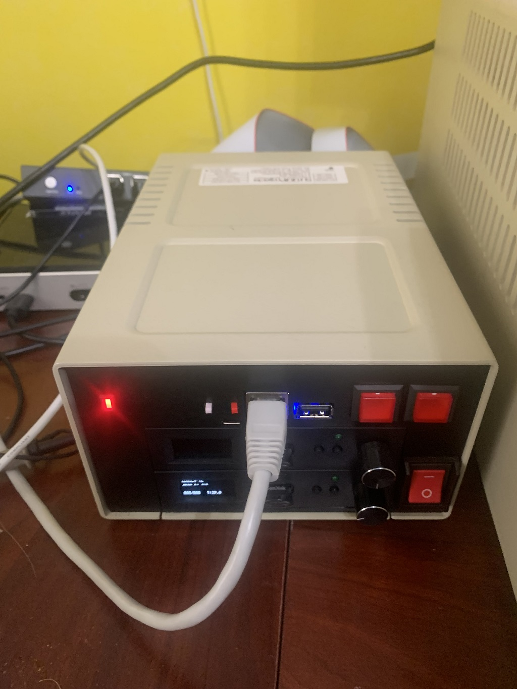

# CompuPro 8/16 Restoration

<b>Table of Contents:</b>
- [Project Purpose and Goal](#project-purpose-and-goal)
- [System Components](#system-components)
  - [CompuPro 816 Chassis](#compupro-816-chassis)
  - [CompuPro Connectors](#compupro-connectors)
  - [FDD HDD Emulation Drive Bay](#fdd-hdd-emulation-drive-bay)
  - [Wyse WY-60 CompuPro Connected Terminal](#wyse-wy-60-compupro-connected-terminal)
  - [TeleVideo 995-65 Terminal](#televideo-995-65-terminal)
- [MFM Emulation Files](#mfm-emulation-files)
- [DDT86 Update](#ddt86-update)
  - [Revised and Bug-Fixed DDT86 Source](#revised-and-bug-fixed-ddt86-source)
  - [Compiled DDT86.CMD Version 2.0](#compiled-ddt86.cmd-version-2.0)
  - [DRI-Lineo License Usage](#dri-lineo-license-usage)

# Project Purpose and Goal #
This particular CompuPro 8/16 S-100 Computer is a multi-user system that ran a central office business solution for a nation-wide high-end retail chain in the mid-80's to the mid 2000's.   
The original base implementation was an order code of 816/F with a base price of $14,995 in 1984.      <b>The features of this configuration included:</b>
- <b>CompuPro Enclosure 2:</b> 20-Slot S-100 Enclosure and Power Supply
- <b>CPU286</b> with Intel iAPX286 Processor
- 512K of Static Memory
- Dual 1.2M 8" Drives and Enclosure
- 40M-Byte Qume Hard Disk
- <b>Concurrent DOS 8/16</b>

The goal of this project is to restore the enclosure, system components, and acquire system terminals to bring the CompuPro system up with original software (Concurrent DOS 8/16) in a similar configuration to it's 1980's central office use.

<b>Current Status (February 2025):</b>

After a couple of years restoring the enclosure and motherboard (replacing a failed to reform power supply cap, and a few tantalums on S-100 boards), the CompuPro 8/16 was exhibited at VCF-Midewest in September 2024.  At that time, the initial setup of Concurrent DOS 8/16 Version 4.1E was complete, but not all software packages were configured properly for all terminals, nor were all system paramaters configured properly.  Still, the setup was reliable and drove one TeleVideo 995-65, one DEC VT-320 terminal, as well as two newer VGA based micro terminal emulators.

<b>Planned for VCF-Midwest 2025:</b>

With the recent addition of a "CompuPro Connected" Wyse WY-60 terminal, two additional Wyse terminals (WY-55's), an additional VT-320 terminal, and an additional TeleVideo (990) terminal, I will have the capability to show the full seven serial terminal setup of the CompuPro 8/16 as built in the 80's.  More information on the final demo details will be available as we get closer to the VCF-Midwest Show date in September 2025.

# System Components #
As originally used, the CompuPro 8/16 came with the following system components and boards (listed in order of slot placement):
- Enclosure 2:
  - 20-Slot Motherboard
  - 8V at 25-Amps
  - +/-16V at 3-Amps each
- 3 x SPUZ Slave Z-80 Processing Boards
  - 64K Local DRAM
  - 2 RS-232 Serial I/O Channels
- CPU286 Main Processor Board
- Alloy IDXCS-100T Tape Backup Interface Board
- 5 Static RAM Boards (768K Total)
  - 4 x RAM21 128K Static RAM Boards (512K)
  - 1 x RAM22 256K Static RAM Board
- System Support 1 Board
  - System Console Serial Port
  - Programmable Interval Timer
  - Real Time Clock with Battery Backup
  - 2 Priority Interrupt Controllers
  - PWRFAIL Signal Generation
- NET 100: ARCNET (DRNET) Network Interface Board
- PC Video (CGA and Keyboard) Interface (for PC-DOS Compatility)
- Interfacer 3+: 8-Channel RS-232 Serial Interface Board
- Interfacer 4:  3-Channel RS-232 Serial with 1 Centronics Parallel Port (added by current owner) 
- DISK 1A: 8" and 5-1/4" Floppy Disk Controller Board
- DISK 3: ST-506 Interface Hard Disk Controller Board

## CompuPro 816 Chassis ##

The CompuPro Chassis is a standard enclosure that hosted most of CompuPro's S-100 Packaged Systems;

## CompuPro Connectors ##

Unlike modern PCs, the CompuPro has no internal floppy or hard drives, and networking (DRNET) was just getting started.  All connections (floppy and hard drives, serial terminals, printer outputs, video displays, and keyboard inputs) are positioned on the rear of the S-100 chassis:

As shown by the installed connectors, the orignal CompuPro system setup was configured for 7 users (6 serial terminals and 1 PC Video Display).  The System Console was only used during OS re-configurations, and so is normally not counted as a user terminal, but can be used as a MODEM port.

The total number of connecter interfaces available are:
- 1 x DB-25 RS-232 System Console Terminal 0 (also used for MODEMs)
- 6 x DB-25 RS-232 Ports (Terminals 1 to 6 or Users 4 to 9)
- 1 x DB-9 CGA Video Output (Color Video output for Users 1 to 3)*
- 1 x DIN-5 IBM-XT Keyboard Port (Keyboard input for Users 1 to 3)*
- 2 x DB-25 RS-232 Printer Ports (LPRT1 and LPRT2)
- 1 x 50-Pin Male Header (8" Floppy Disk Interface)
- 1 x 34-Pin Male Header (5-1/4" Floppy Disk Interface)
- 1 x 34-Pin Male Header (ST506 Hard Disk Interface)
- 2 x 20-Pin Male Header (Read/Write Channels for HDD1 and HDD2)
- 1 x BNC RF Connector for NET 100 (DRNET)

## FDD HDD Emulation Drive Bay ##

Although I have two of the orignal CompuPro external floppy drive bays, I do not have an original hard drive bay.  This makes it difficult to completely replicate a 1980s Qume Hard Drive setup.  Adding to that, since the 40MB and 80MB drives that the CompuPro 8/16 originally used are not now widely available and the fact that any 40 year old used drives would be of (very?) dubious reliability, I instead decided to use two Gotek Floppy Emulators and a <b>pdp8online</b> MFM Emulator for hard drive emulation.

I built this enclosure out of a used (and very abused!) Apple II drive enclosure that I had spare.  Since the rear panel of the enclosure was damaged, (and since Apple II drive bays are still very plentiful on eBay), I felt no qualms modifying this unit for the purpose. 
I also 3D-Printed a drive front panel and drive mounting cage that secures the Goteks and MFM Emulator in the original case mounting bosses.

<b>The advantages of this approach are:</b>
- More reliabiity (no moving parts)
- Smaller, low-weight package (much easier to carry to VCF!)
- Simplified backup of hard disk images (via WinSCP over ethernet)
- Easy to switch between hard disk and floppy image

## Wyse WY-60 CompuPro Connected Terminal ##

I acquired this terminal in Charleston (Thanks Terry!), and I was surprised to find it was a "CompuPro Connected" terminal.  I wasn't aware that such a relationship between CompuPro and Wyse existed into the 1990s.  It just shows that despite the rapid adoption of the IBM PC platforms, these mid-end business solutions were still a market presense throughout the 80s and 90s.

## TeleVideo 995-65 Terminal ##

<b>The Heat Damaged Pizza Terminal</b>

This terminal was an eBay rescue from Texas.  It was an IT company lease to a national pizza chain call center based in the Dallas area, and was returned to the IT company (located between Dallas and Houston) when the pizza company upgraded their systems in the 2010s.  It was then stored outside under a tarp for a period of time before it was sold on eBay. 

When I recieved the unit, it exhibited several signs of heat exposure and damage:
- A bowed bottom case (but no breaks, meaning the bow occured over time under heat)
- Leaking Caps
- Yellowed Case
- Unstable horizontal oscillator and switching power supply

The bowing of the bottom of the case is observable in the following photo, where you can see an upward bow in the center under the PCB (which in addition to the damaged and leaking caps, shows further evidence of the long-term heat exposure).  Of note is that the Printed Circuit Board also acquired this bow, even when removed from the case, meaning that the high temperature at the PCB went past the epoxy Transition Point (Tg) temperature.  See: [Glass Transition Temperatures](https://en.wikipedia.org/wiki/Glass_transition).

<b>Replacing the Caps</b>

The first task was to replace the caps.  I chose to replace all the electrolytics due to the heat exposure.  This was also a preventative measure as this terminal was made during the "Capacitor Plague" and several of the caps were from affected cap manufacturers.  The Cap Replacement also fixed the Horizontal Oscillator and Switching Power Supply issues.  

After replacing the caps, I did a partial reassembly to verify the repairs.

<b>Cleaning up the case</b>

The bowing at the bottom of the case was not fixed as the PCB (being hard mounted to the bottom of the case) also ended up with a bow, and I did not want to put stress on the PCB's solder joints.  Also, the front bezel covers up the bow at the bottom of the case, so fixing the bow would not offer any cosmetic improvement.     

The case was Retro-Brited using the Hydrogen Perioxide Vapor Method (if interested in this method, search YouTube for it).  The results were very good and did not seem to embrittle, mottle, or discolor the plastic.

# MFM Emulation Files #

Following are two blank Hard Disk Emulation files for the CompuPro 8/16.  These are provided to allow other CompuPro users to start with a valid, low-level image that can then be formatted with the CompuPro hard disk format tools and CDOS Installation Disks. 

Two CompuPro compatible low-level images were generated, a <b>40MB Qume Q540</b> image, and an <b>80MB Control Data Corporation CD94155</b> image.  The drive specific formats are below.

<b>Qume Q540 Drive Specifics:</b>
  | <b>Drive Spec</b> | <b>Value</b> |
  |----------------|----------------|
  | <b>Cylinders</b>  | 512     |
  | <b>Heads</b>      | 8       | 
  | <b>Sectors/Track</b> | 17      |
  | <b>Formatted</b>  | 36MB |
  | <b>Unformatted</b> | 43MB |   

<b>Control Data CD94155 Drive Specifics:</b>
  | <b>Drive Spec</b> | <b>Value</b> |
  |----------------|----------------|
  | <b>Cylinders</b>  | 925     |
  | <b>Heads</b>      | 9      | 
  | <b>Sectors/Track</b> | 17      |
  | <b>Formatted</b>  | 72MB |
  | <b>Unformatted</b> | 86MB |

The two disk images below were generated by the MFM Emulator using the following initialization commands: 

<b>Q540:</b> 
`mfm_emu --drive 1 --file Q540 --initialize --cylinders 512 --heads 8`

<b>Control Data CD94155:</b> 
`mfm_emu --drive 1 --file CDC80 --initialize --cylinders 925 --heads 9`

## Qume Q540 40MB Disk Image: ##

[Q540 40MB Disk Image](Docs/Q540.zip "Q540 40MB Low-Level Disk Image")

## Control Data CD94155 80MB Disk Image: ##

[CDC80 80MB Disk Image](Docs/CDC80.zip "CDC80 80MB Low-Level Disk Image")

# DDT86 Update #

Recently (January, 2025), one of the Slave Z80 Processor (SPUZ) Boards in my CompuPro 8/16 started having problems and was corrupting the pool of Z80 slave boards.  Since the control port for this board is only accessable via 8086 I/O Port reads and writes, I was looking for a CP/M-86 debugger that supported I/O reads and writes.  Looking through the various CP/M-86 manuals, I saw many references to DDT86 and its QI/QO port input and output commands that supported this, but my copy of DDT86 in Concurrent DOS 8/16 4.1E did not. 

Looking further afield, I came across Tim Olmstead's legacy site on CP/M Source Files [http://www.cpm.z80.de](http://www.cpm.z80.de).  Tim is no longer with us, but he was an invaluable resource helping us restore and maintain these vintage, CP/M based systems.  If you want to learn more about Tim, please visit his memorial page here: [http://www.cpm.z80.de/tim.htm](http://www.cpm.z80.de/tim.htm).  This site is now maintained by Gaby Chaudry, and many thanks to him for keeping this site running. 

After perusing the cpm.z80.de site, I found several source copies of DDT86 (all 1.1 copies that didn't support I/O port commands) and one single copy of DDT86.A86 Version 1.2, located in the D7 folder of this zip archive link: [http://www.cpm.z80.de/download/ccpmv31.zip](http://www.cpm.z80.de/download/ccpmv31.zip).  Beware though!  This source file has several issues, most of which seem to have been caused by some [Bit Rot](https://www.howtogeek.com/660727/bit-rot-how-hard-drives-and-ssds-die-over-time/) on the orignal diskettes that these files were archived from.  note bene - this is NOT a critism of the cpm.z80.de website!  It is often difficult to preserve the original copies of commercial software due to Copyright and Intellectual Propery Rights provisions, so the fact that these are available at all is a minor miracle for the vintage computing hobby.

In fixing the issues with DDT86 version 1.2, I found eight Bit Rot errors that I corrected in the DDT86.A86 source file below by WinMerge comparing this 1.2 version with other version 1.1 copies in other zip archives on the cpm.z80.de website.  I also found a programming error where the sign-on message was garbled due to placing the source string in the Code Segment section of the program, whereas Concurrent DOS (and CP/M-86!) expect all console calls to use the Data Segment.  This was an easily fixed by moving the sign-on message to the Data Segment. 

There was also a section of code that was reading the display column mode configuration (i.e. 40 versus 80 columns of the orignal IBM CGA adapter), so I believe this version of DDT86 was being developed for a Concurrent CP/M-86 release for the IBM PC and not specifically targeted at S-100 CP/M-86 terminal based systems.  Still, this display mode checking code is probably not implemented on earlier CP/M-86 systems using serial terminals, and since I am not sure which CP/M-86 systems supported this particular BDOS call, I thought it was safer to comment this check out since the rest of the code defaults to 80-column mode when this check is not performed. 

Thinking about the sign-on message bug further, I think the original disk this was found on was a set of Beta sources that were still being worked on, and so the bug had not yet been fixed.  Regardless, in every section where I made changes to the functionality of the original source, I inserted a comment with my initials (JLW) to make it easy for others to find and/or remove or augment my modifications.  You can find my modified source below (which now reports its version number as 2.0 as I didn't want users confusing this source with actual released DRI software).

## Revised and Bug-Fixed DDT86 Source ##

[JLW Modified DDT86.A86 v2.0](Docs/ddt86.a86 "JLW Modified DDT86.A86 v2.0")

## Compiled DDT86.CMD Version 2.0 ##

[JLW Modified DDT86.CMD v2.0](Docs/ddt86.cmd "JLW Modified DDT86.cmd v2.0")

## DRI-Lineo License Usage ##

The Digital Research, Inc. (DRI) source files are Copyright protected and it is neither abandon-ware or under an open-source license.  However, the current copyright owners (Lineo or more specifically Bryan Sparks) have granted rights to "the community" to "use, <b>distribute, modify, </b>, and otherwise make available in a nonexclusive manner CP/M and its derivatives".  (Emphesis mine.) You can find the hostory and intent here [Brian Sparks/Scott Chapman Email Exhange on CP/M Licenses](http://www.cpm.z80.de/license.html).
